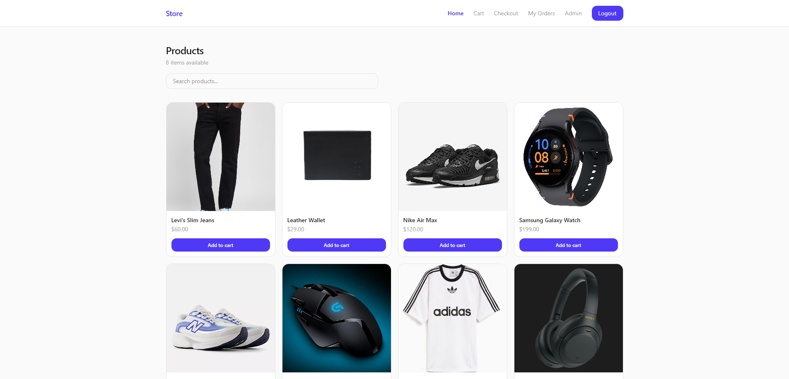

# Mini E-Commerce - Frontend

React frontend for the Mini E-Commerce store. Built with React, Vite, and Tailwind CSS.



## Features

- Browse all products without logging in
- Search products by name
- View individual product details with quantity selector
- Add to cart as a guest, login required to place an order
- Cart with quantity controls, order summary, and free shipping threshold
- Checkout with shipping address form, tax (15%) and shipping calculation
- Order confirmation page after placing an order
- Order history with status (Processing, Delivered) per user
- Admin panel visible only to the admin user with revenue stats and order management
- Admin can mark orders as delivered
- Navbar hidden on login and register pages
- Private routes redirect unauthenticated users to login

## Tech Stack

React, Vite, React Router, Tailwind CSS, Context API

## Folder Structure

```
├── src/
│   ├── components/       # Navbar, AdminRoute, PrivateRoute
│   ├── pages/            # Home, Cart, Checkout, Login, Register, MyOrders, OrderConfirmation, ProductDetails, AdminOrders
│   ├── AuthModalContext.jsx
│   ├── App.jsx
│   └── main.jsx
├── public/
├── .env
└── index.html
```

## Pages

- `/` - Product listing with search
- `/product/:id` - Product detail page
- `/cart` - Cart with order summary
- `/checkout` - Shipping details and order placement (protected)
- `/myorders` - User order history (protected)
- `/login` - Sign in
- `/register` - Create account
- `/admin/orders` - Admin order management (admin only)

## Setup

1. Clone the repo
2. Run `npm install`
3. Create a `.env` file in the root:
VITE_API_URL=https://your-backend-url.vercel.app
4. Run `npm run dev`

## Deployment

Deployed on Vercel. Set `VITE_API_URL` in Vercel environment variables.